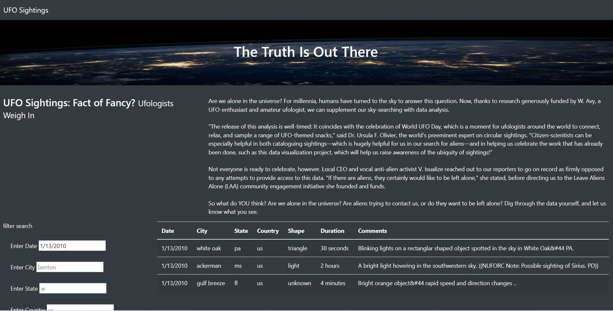

## UfOs Project.

### Overview of Project:

This project, it's built a table using data stored in a JavaScript array. It also contains filters to make this table fully dynamic, meaning it will react to user input and then place the table into an HTML file for easy viewing. It customizes the webpage using Bootstrap and equips the tables with several fully functional filters allowing users to interact with our visualizations.
In addition, it provides a more in-depth analysis of UFO sightings, allowing users to filter for multiple criteria simultaneously. Furthermore, selecting the date will enable the end-users to interact by choosing table filters for the city, state, country, and shape.

### Results:

During the process of creating the code for the website, it was addressed to the team that the central aspect was to allow end-users to interact with the interface and, consequently, choose the information they wished. That was the project's focus; all research performed by the sponsor needed to be available to the public. Overcoming the first milestone, the project team has reached the following results:

Of course, after the results of the early stages, the next step was the add the interactivity function to the web page. At that moment, it was necessary to conduct a brainstorming process to figure out what could be the best way to provide the readers quick adaptability when searching for information. As an outcome, the team reached the following solution, demonstrated in the figure below:

### Summary:

In summarizing, there was realized the necessity of some future adjustments and improvements regarding the drawbacks of the design and recommendations for further development. After reviewing the app.js file, the filtered data wasn't working correctly when deploying the website for the first time; some adjustments were made to question 9. Chasing to take the challenge to a new stage, the team has recommended the following improvements:

a) Drawbacks:
- The filters don't provide auto-complete spellings, and when searching, the field is "case-sensitive," one aspect that is outdated and may cause unsatisfactory from the user-end.
- At the same time, the table is complex when updated; it's necessary to know how the data needs to be stored.
- From the user's side, they need to have previous knowledge about the subject, and the interface is not friendly for whom is only satisfying their curiosity or navigating the web.

b) Future adjustments:
- At first, the future adjustments must solve some issues described in the drawbacks. Provide auto-complete spellings, remove the "case-sensitive." constraint in the filters, and so on.
- The website uses data provided by the sponsor; it may be a significant improvement if the team uses its web scraping knowledge to instantly link the project with updated information.
- From the functionality side, the project can add the finest resources using Bootstrap, for instance, dropdown menus and highlighting when passing the mouse over. Combining design, branding, function, and accessibility improves user experience (UX).