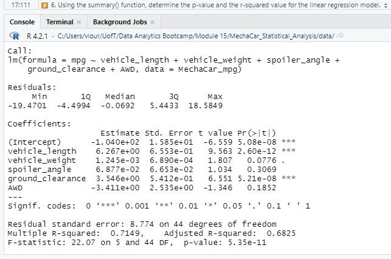

# MechaCar Statistical Analysis Project.

## Project Description.
The upper management addressed the project team on a particular project. AutosRUs’ newest prototype, the MechaCar, is suffering from production troubles blocking the manufacturing team’s progress. Indeed, AutosRUs’ upper management has called the data analytics team to review the production data for insights that may help the manufacturing team.

## Project Scope:
- Perform multiple linear regression analysis to identify which variables in the dataset predict the mpg of MechaCar prototypes.
- Collect summary statistics on the pounds per square inch (PSI) of the suspension coils from the manufacturing lots.
- Run t-tests to determine if the manufacturing lots are statistically different from the mean population.
- Design a statistical study to compare the vehicle performance of the MechaCar vehicles against vehicles from other manufacturers. For each statistical analysis, reporting a summary interpretation of the findings.

## Project Deliverables
This new project consists of three technical analysis deliverables and a proposal for further statistical study. The team was assigned to accomplish the following outcomes:
- Deliverable 1: Linear Regression to Predict MPG.
- Deliverable 2: Summary Statistics on Suspension Coils.
- Deliverable 3: T-Test on Suspension Coils.
- Deliverable 4: Design a Study Comparing the MechaCar to the Competition.

### Linear Regression to Predict MPG
For this deliverable, it is necessary to fulfill some parameters to respond to the three questions below and help the understand the method of evaluation; as shown in the attached picture:

Which variables/coefficients provided a non-random amount of variance to the mpg values in the dataset?
- In this question, the best approach to respond is in the results,  three variables that behave with a non-random amount of variance: the intercept, the vehicle length and ground clearance; they demonstrate that there has been a smaller p-value; being direct, it is statistically significant. Opposite, the rest of the variables are not statistically significant; if there were the possibility of getting more data, the model would change or skip these variables to help its efficiency.

Is the slope of the linear model considered to be zero? Why or why not?
- The results of the p-value of our linear regression analysis are 5.35e-11, which is smaller than the significance level of 0.05%. Albeit, it is possible to conclude that the evidence to reject the null hypothesis has been found in the procedure, which means that our linear model's slope is not zero.

Does this linear model predict mpg of MechaCar prototypes effectively? Why or why not?
- When executing a multiple linear regression model, the r-squared value results in 0.7149, meaning that 71% of the variability (miles per gallon - mpg) is directly related to using it. Although the analysis is suitable for predicting the given dataset, the lack of significant variables is evidence of overfitting. The model performs well with a current dataset but fails to generalize and predict future data correctly.

### Summary Statistics on Suspension Coils.
Analyzing this deliverable's result, the team concluded that the variance of the suspension coils must not exceed 100 pounds per square inch, respecting the design specifications for the MechaCar suspension coils. However, there was a discrepancy for Lot 3, a variance of 170, which is much higher than the design specification's limit of 100 psi; lots 1 and 2 all satisfy the design specifications.

Therefore, the picture above helps to respond to the question placed by the upper management whether the current manufacturing data meet the design specification (the suspension coils must not exceed 100 pounds per square inch) for all manufacturing lots in total and each lot individually. Comparing the summary data for all three lots demonstrates that the variance is 62.3 pounds per inch, below the specified value. However, Lot 3 is clearly above the specifications.

### T-Test on Suspension Coils.
Continuing the data set studies, the analysts' team reached a result that the PSI throughout Lot 3 is statistically distinct from the population mean, as shown by the data above, where Lot3's p-value is less than 0.05 percent. Therefore, the null hypothesis can be rejected. On the other hand, because Lots 1 and 2 both have p-values over the significance level, it's impossible to deny the null hypothesis. In conclusion, there hasn't been any significant difference between Lots 1 and 2, reaching the population mean. 

As demonstrated by the outcomes in the picture above, the behaviour of the samples allows the analysts to deny or accept the null hypothesis. For that purpose, all data sets assumed the significance level as 0.05 percent.

### Design a Study Comparing the MechaCar to the Competition.
In conclusion, Using R as a tool, this statistical study compares the performance of the MechaCar vehicles against the implementation of cars from other manufacturers. Handling the data set given, the need for more data related to previous years and similar models of other manufacturers was observed for the data exploration.
The statistical study design answers some questions, following the path:
- A tested metric is to be mentioned. Scrutinizing a possible demand (quantity of sales) for the new model, a manufacturer should consider considerate specific characteristics such as cost, colour, safety types of equipment, fuel efficiency, engine size, and type of fuel (Nowadays, it is highly recommended hybrid system) and last, the body type (SUV, sedans, and so on).
- Some variables were proposed to predict demand for a new model release by describing a null or alternative hypothesis. For instance, Null Hypothesis (H0), the slope of the multiple linear models is zero (m = 0). In the alternative hypothesis (Ha), the slope of multiple linear models is different from zero (m ≠ 0).
- A statistical test was used to test the hypothesis; the analysts estimated a linear regression handling two or more independent variables. This method allows the team to review each independent variable to determine the existence of a relationship with the dependent variable.
- For the statistical test data, regarding statistical significance, an aleatory sample of at least 30 individual data for MechaCar and their competitor is requested. Otherwise, the model would lack importance for the study.
