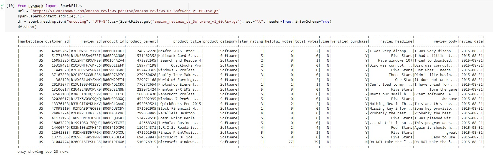
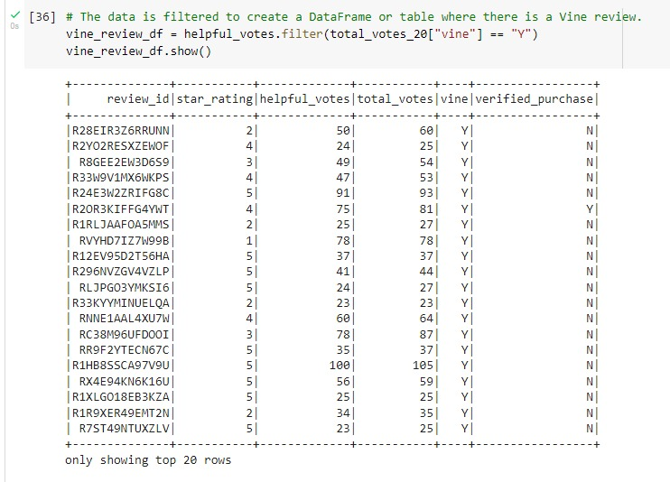
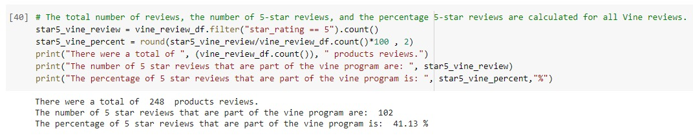
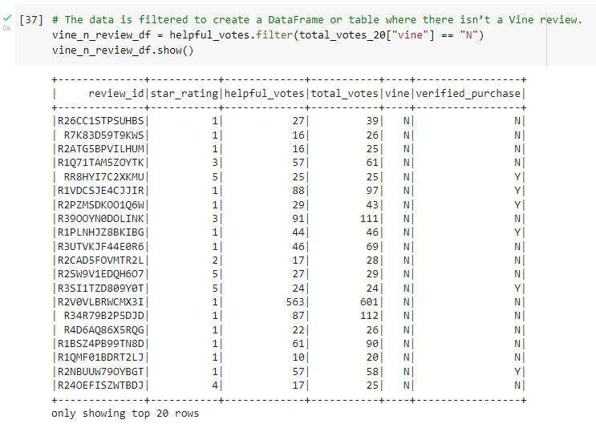
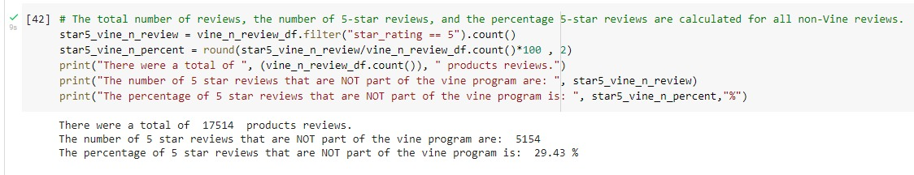

# Amazon Vine Analysis Project

## Project Overview.
The project aims to identify Amazon Vine, which selects the most insightful reviewers in the Amazon store to serve as Vine Voices. The program seeks to order items free of charge and share their product experiences with Amazon customers to help them make informed buying decisions. The program may request products from thousands of brands in the Amazon store, which are shipped to their doorsteps at no cost. Then, customers use the products and provide insightful reviews that reflect their honest and unbiased opinions – positive, neutral or negative.
As a subject chosen, the select data were about Software and filtered to determine the number of products with 5-star reviews (at least 20 counts), reaching 50% receiving helpful votes and their relative percentages from manufacturers not part of the program. As a result, the project team got the actual results of the dataset provided, including the reviews of the members of the program and the non-members, to have a close analysis of its accuracy.

## Project Deliverables.
- Deliverable 1: Perform ETL on Amazon Product Reviews.
- Deliverable 2: Determine Bias of Vine Reviews.
- Deliverable 3: A Written Report on the Analysis.

## Project Results.
When manipulating the dataset, the team was faced with some challenges to answer. As the subject of software selling, the staff started working on the original dataset, as shown in the figure below:

With the outcomes on hand, using the filtered DataFrame and images of them as support, it addressed the following questions:

- How many Vine reviews and non-Vine reviews were there?
- How many Vine reviews were 5 stars? How many non-Vine reviews were 5 stars?
- What percentage of Vine reviews were 5 stars? What percentage of non-Vine reviews were 5 stars?

a) Vine Reviews:
Starting with Vine reviews, the analysts filtered the DataFrame separating the helpful votes, then counted the positive ones. As demonstrated in the picture below:

Regarding that analysis, it was reached the following conclusion, as per the written code shown in the picture below:
- There were a total of 248 software reviews.
- The number of 5 stars reviews that were part of the program was 102.
- The percentage of 5 stars reviews that were part of the program is 41.13%.

b) Non-Vine Reviews:
Finally, it was studied the analysis of non-Vine reviews, where was filtered the customer data that wasn't part of the program, written the code and reached the results demonstrated in the pictures below:

After the previous analysis, it's possible to ensure that:
- There were a total of 17514 software reviews.
- The number of 5 stars reviews that were NOT part of the program was 5154.
- The percentage of 5 stars reviews that were NOT part of the program is 29.43%.

## Project Summary.
Possessing the results of the analysis, the category of software selling, there was an unbalance outcome comparing the percentage of 5-star reviews with more than 20 helpful reviews related to both Vine and non-Vine sellers. Therefore, it's recommended a review bias. 
On the other hand, many reviews were identified in the non-Vine category, which suggests that most sellers selected not to participate in the program. Being out of the program may not provide marketing exhibitions or benefits compared to what is offered for those participating.
That pushes us to conclude that there is a question mark if the data is reliable for using them in comparison or creating a coefficient, considering a few different factors that affect the research, and gaining a basic understanding of the statistics involved. Considering the population size, it's necessary to conduct an afterwards analysis, comparing the number of 5-star reviews facing the total number of listings, the number of products with more than 20 reviews, and at the end, checking purchases and weighing the percentages.
