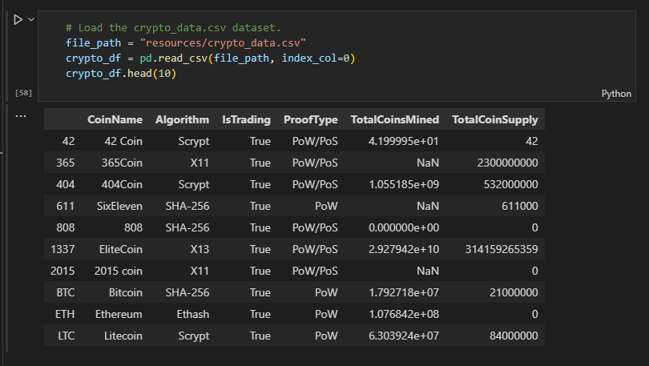
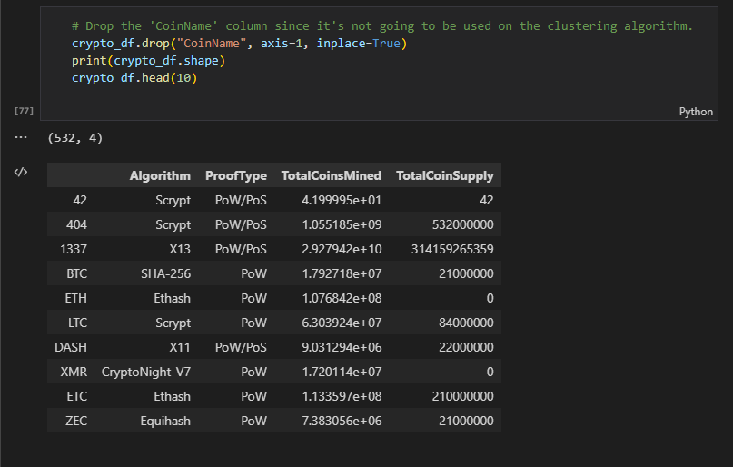
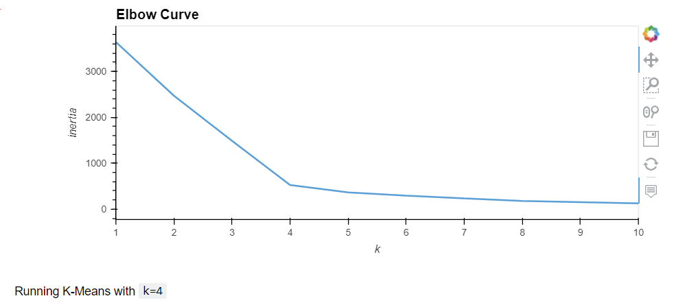
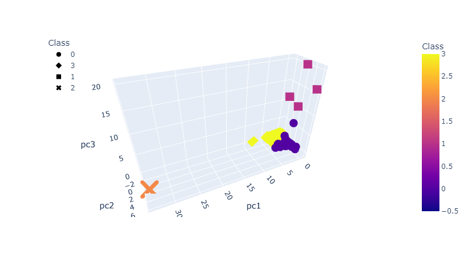
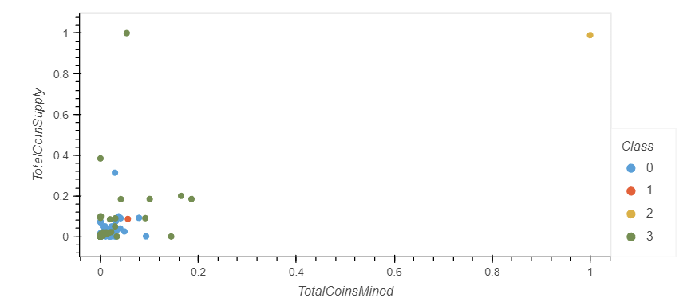

## Cryptocurrencies Analysis Project.

### Project Description.
The stakeholders are convinced that unsupervised learning is the best way forward for the dataset because the team is looking for any groupings, trends, or other information that could help the company pitch cryptocurrencies. In this approach, the input data already has a paired outcome, plugged in to train the model to predict outcomes in new datasets. For example, if it's wanted to build a model that, when given unfamiliar data, can accurately predict the results.

### project Scope.
Senior manager for the Advisory Services Team at Accountability Accounting, one of your most important clients, a prominent investment bank, is interested in offering a new cryptocurrency investment portfolio for its customers. However, due to the vast universe of cryptocurrencies, this project creates a report that includes what cryptocurrencies are on the trading market and how they could be grouped to create a classification system for this new investment.
The data collected could be better, so it must be processed to fit the machine-learning models. Since there is no known output for what is looked for, the project manager has decided to use unsupervised learning. To group the cryptocurrencies, it agreed on a clustering algorithm. As a result, data visualizations will be used to share the findings with the board of directors.

### Project Deliverables.
This new project consists of four technical analysis deliverables. It will be reported the following:
- Deliverable 1: Preprocessing the Data for PCA.
- Deliverable 2: Reducing Data Dimensions Using PCA.
- Deliverable 3: Clustering Cryptocurrencies Using K-means.
- Deliverable 4: Visualizing Cryptocurrencies Results.

### Results:
- The collected Dataframe as project kickoff contains the following structure:

- After the process of cleaning the data, the data frame presents the following aspect:

- After formatting the Elbow Curve, obtains the suitable value for K=4:

- For visualizing Tradable Cryptocurrencies, it was utilized a 3D Scatterplot with Clusters:

- Last but not least, with the data cleaned on hand, it was built a tradable cryptocurrencies scatter plot.

## Project Results.
This project suggests that with skill, experience, and computational power, unsupervised machine learning can be usefully applied in cryptocurrency trading, facilitating decision-making. However, the models must be carefully calibrated against others to have tremendous success. As demonstrated in this project, the loaded algorithms resulted in four cluster formatting, delivering for the stakeholders a precise scenario for figuring out which coins the investment must focus on.

