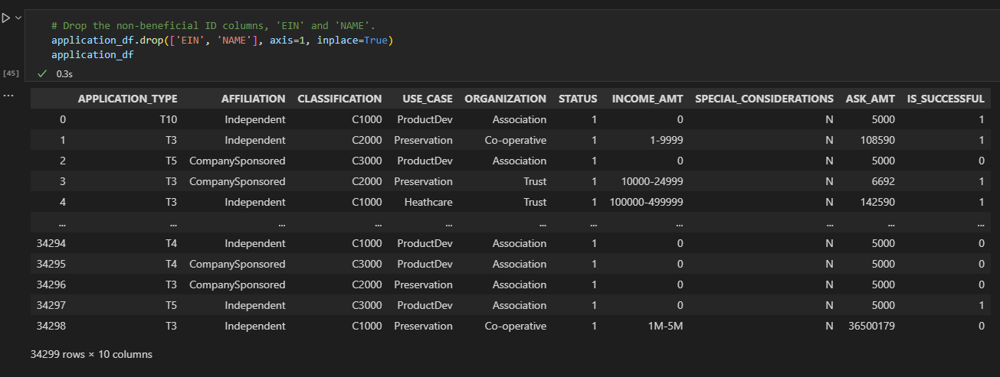
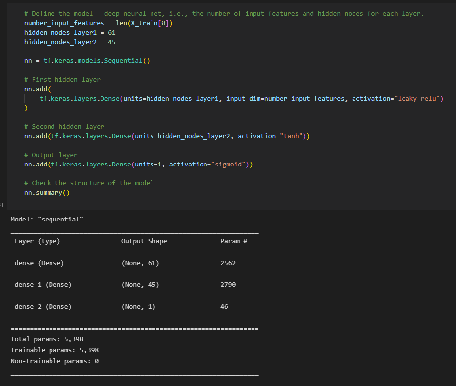

## Neural Network Charity Analysis Project.
### Project Description.
The team project had come a long way since her first day at that boot camp five years ago and earlier this week when they started learning about neural networks! Now, they are finally ready to put their skills to work to help the foundation predict where to invest. With their knowledge of machine learning and neural networks, they’ll use the features in the provided dataset to help the team create a binary classifier capable of predicting whether applicants will be successful if funded by Alphabet Soup.

From Alphabet Soup’s business team, the analysts received a CSV containing more than 34,000 organizations that have received funding from Alphabet Soup over the years. Within this dataset are several columns that capture metadata about each organization, such as the following:
- EIN and NAME—Identification columns
- APPLICATION_TYPE—Alphabet Soup application type
- AFFILIATION—Affiliated sector of industry
- CLASSIFICATION—Government organization classification
- USE_CASE—Use case for funding
- ORGANIZATION—Organization type
- STATUS—Active status
- INCOME_AMT—Income classification
- SPECIAL_CONSIDERATIONS—Special consideration for application
- ASK_AMT—Funding amount requested
- IS_SUCCESSFUL—Was the money used effectively

### Project Deliverables.
This project consists of three technical analysis deliverables and a written report. It has as outputs the following:
- Deliverable 1: Preprocessing Data for a Neural Network Model
- Deliverable 2: Compile, Train, and Evaluate the Model
- Deliverable 3: Optimize the Model
- Deliverable 4: A Written Report on the Neural Network Model (README.md)

### Overview of the Analysis.
The project aimed to create a neural network machine learning model. The process used a binary classifier that will be useful in helping the cooptation of new donators for Alphabet Soup. With the application of machine learning and neural networks on the dataset collected, the project outputs a classifier model that can predict the rate of success for marketing campaigns.
Tools used in the project:
- Pandas, Scikit-Learn, TensorFlow and Keras.

### Results.
- Data Preprocessing:
    - The variables considered as the targets for the model, the 'IS_SUCCESSFUL' column collected from the dataset served as input for that purpose.
    - Related to the features, the dataset columns kept after the cleaning are demonstrated in the picture below:
    
    - According to the picture above, the motive for why EIN and NAME columns were dropped lies over the reason that acts much as indexes than data. Therefore, they couldn't be considered features or a target.
- Compiling, Training, and Evaluating the Model:
    - First, it settled the input features and hidden nodes for each hidden layer for the deep neural network model and set up the checkpoint path and the filenames. Afterwards, the model with loss was adopted as binary_crossentropy and used the optimizer as “adam.”
    - At that stage, The models could not achieve the 75% accuracy performance target in testing, as desired by the analysts. After analyzing the results, it was opted to optimize the model to achieve a target predictive accuracy higher than 75% by using the following: dropping the column “Special_considerations,” which didn't impact the accuracy provoking losses; next attempt, it changed the activation function of the second layer to “tanh” resulting the following loss and accuracy as demonstrated in the picture below:
     
    - As a result, it obtained the desired accuracy without impacting the loss in the model:
    268/268 - 0s - loss: 0.5522 - accuracy: 0.7282 - 226ms/epoch - 844us/step
    Loss: 0.5522266626358032, Accuracy: 0.7281632423400879

### Summary.
In summary, it reached an accuracy close to 75%, but at the same time, the same process produced losses of over 50% on the model. In theory, the following steps would be to process more data reduction; for instance, logistic regression could be performed by binning.  It could decrease accuracy, which is a requirement for this project; however, applying the decision tree technique increases the accuracy compared to the deep learning model.