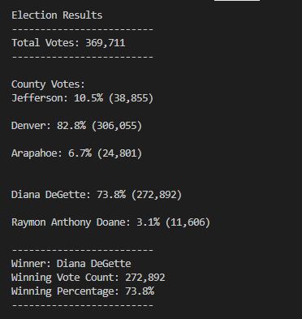

# Election Audit

## Overview of Election Audit: 
The Colorado Board of Elections addressed the scope of this project for the team to work on processes automated aiming to audit the election placed in given counties, for that purpose, the data analysts ran Python codes. The board collected the data set and delivered it to the project team in a CSV file format; in this way, the programmers manipulated the data, cleaning and selecting the ones that were objects of the scope. 
As the central project deliverable, the goal is to write a program that will be successfully installed and running correctly,  with its code might be able to be refactored for the auditors can use in other election processes. 

## Election-Audit Results: 
- 369,711 votes were cast in the congressional election.
- Breakdown of votes per county
  - Jefferson had 38,855 votes which was 10.5%
  - Denver had 306,055 which was 82.8%
  -  Arapahoe had 24,801 votes which was 6.7%
- Denver County had the largest number of votes.
- Breakdown of votes per candidate
  - Charles Casper Stockham had 85,213 votes which was 23.0%
  - Diana DeGette had 272,892 votes which was 73.8%
  - Raymon Anthony Doane had 11,606 votes which was 3.1%
- Diana Degette won the election with 272,892 votes which was 73.8% of the total votes.

## Election-Audit Summary: 
As a deliverable, the project team had an important achievement, making the code available to be reused for afterwards elections. The main advantage of Python is its capability to manipulate large amounts of data into built-in libraries.

It's possible to use the same application replicating its code for posteriors audits, only by declaring new variables and reformulating existing "for" and "if" statements. The outcomes of the analysis must be exported to a txt format, making them available for regular users and increasing their experience. Besides that, we attached to this report an image showing the obtained results when the programmer runs the code, a fast way to check the code properties.

