# School_District_Analysis

## Overview of the school district analysis
The school board has actioned the project team regarding the discovery that the grades for Thomas High School were untrusted. This analysis aims to manipulate both subjects'  preserving data integrity. The next task is to analyze the school district data for spending and academic foresees in a real scenario with the correct dataset. This project has a deliverable to track on a district level. Therefore, the project team must resolve any attempt to corrupt data at Thomas High School must be determined to avoid impacts on overall rankings.

Results:
- How is the district summary affected?
  - As shown in the figure below, the change does not significantly affect the district summary. Considering the entire district as a study object, removing the ninth-grade class from its related school impacts the average math score, passing reading rate, passing math rate, and overall passing rate.
  - Before:
  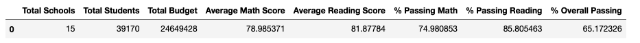
  
  - After:
  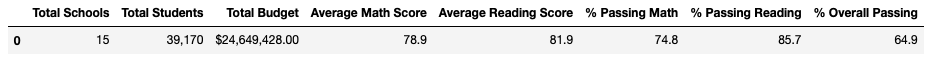
  
  
- How is the school summary affected?
  - Considering the results demonstrated below, the school summary is not notably affected by the dataset change. As observed, the average math score suffers decreased, and the average reading score slightly increased. However, those impacts did not affect the overall Thomas High School ranking.
  - Before:
  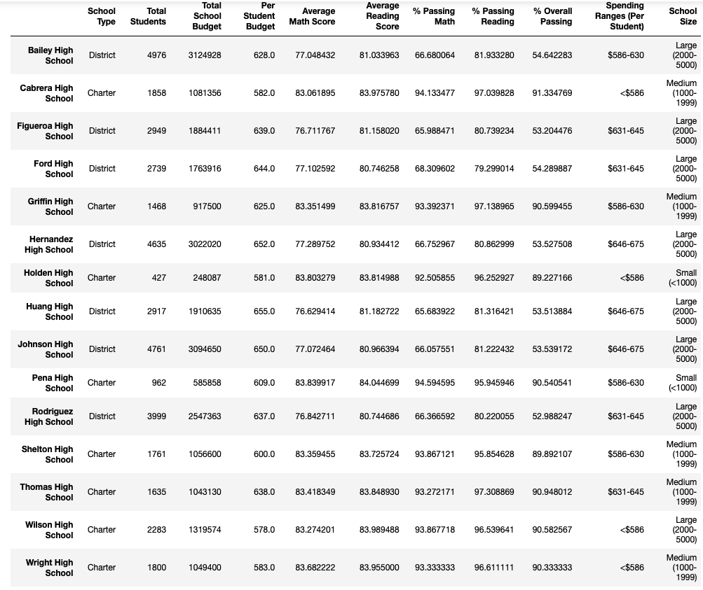
  
  - After:
  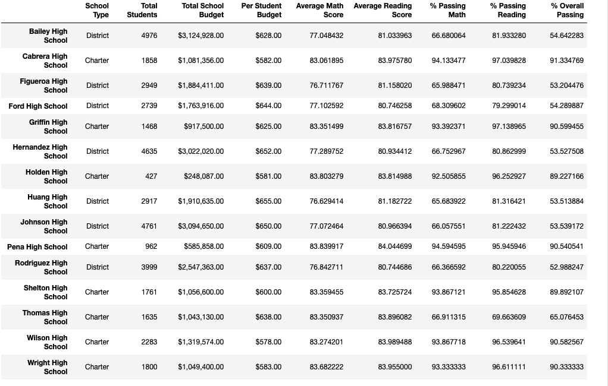

- How does replacing the ninth graders’ math and reading scores affect Thomas High School’s performance relative to the other schools?
  - That's an important question leveraged by the team,  the absence of the ninth-grade reading scores, indeed, does not affect overall 2nd place rank.
  - Before:
  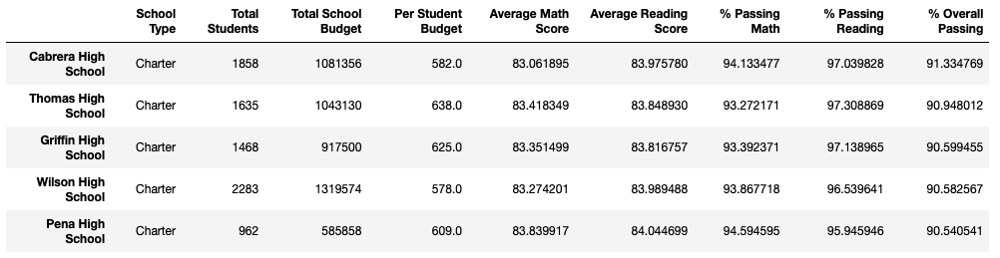
  
  - After:
  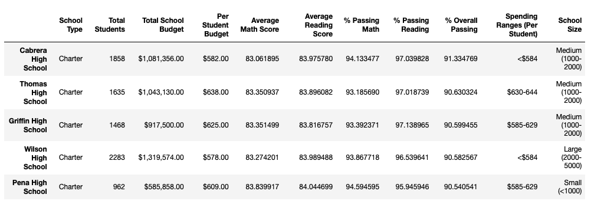

- How does replacing the ninth-grade scores affect the following:
  - As shown in the following pictures, the 9th-grade math and reading scores performed by the students at Thomas High School are removed, and their impacts analyzed. 
   - Math Before:
   
   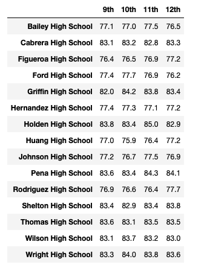
  
   - Math After:
  
  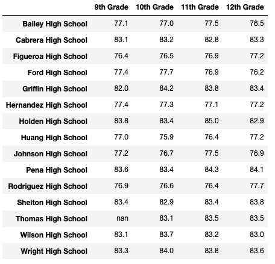
  
   - Reading Before:
  
  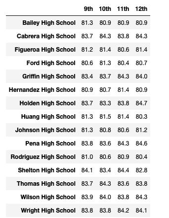
  
   - Reading After:
   
   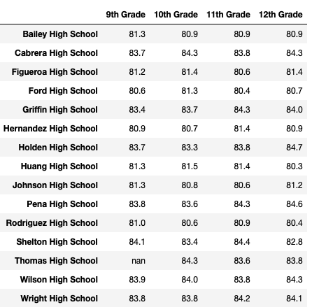
  
- Now, the project team went into the comparison between scores versus school spending. It's interesting to note that scores by spending remained essentially unchanged with a slight decrease in reading passing and passing overall.
  - Before:
  
  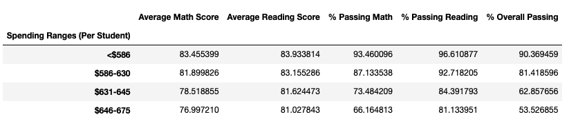
  
  - After:
 
  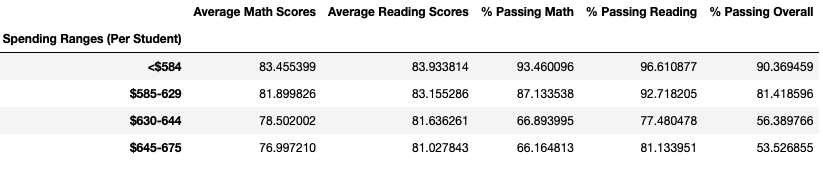

- Comparing the outcomes obtained, we've noticed that the scores by school size changed as the medium (1000-2000) group saw reductions in passing math, reading, and overall passing rates.
  - Before:
  
  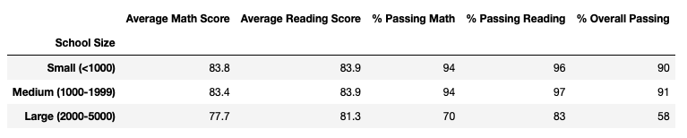
  
  - After:
  
  

- The table emphasizes that the school passing rates dropped across math, reading, and overall scores by school type.

  - Before:
  
  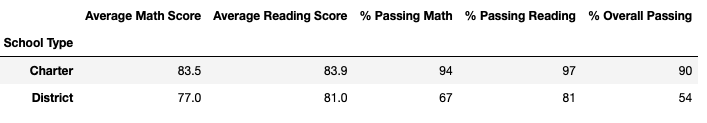
  
  - After:
  
  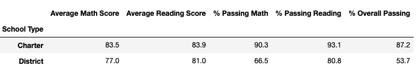

## Summary:
In conclusion, the results of the change were categorized into four topics in the updated school district analysis after reading and math missing scores values for the ninth grade at Thomas High School have been replaced, and they are:
- From a district summary perspective, slight reductions (<0.05) were seen in average math score, passing reading rate, passing math rate, and overall passing rate.
- Reading passing grades for the scores by size analysis reduced in the medium (1000-2000) school size bucket by approximately 5%.
- In terms of scores by school type, the charter school type saw slight reductions in passing math rate, passing reading rate, and overall passing rate (all approx. 5%)
- In scores by spending, the passing reading, math, and overall passing rates dropped significantly in the $630-644 bucket. (all near or above 5% reductions).

