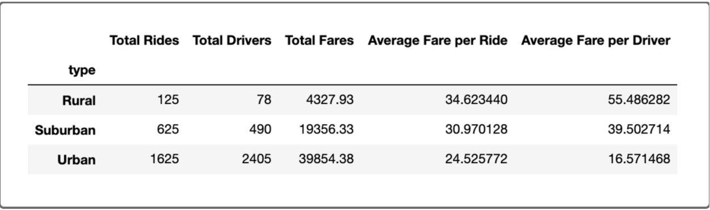
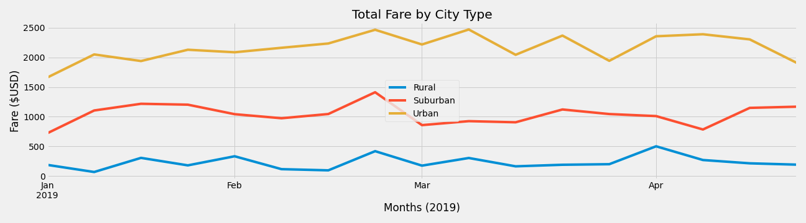

## PyBer_Analysis

### This project aims as the main deliverable to investigate through a given data frame, the outcomes of ride-sharing data by zoning types (Urban, Suburban and Rural). Received the data, was made a multiple-line graph that demonstrates the total fare by kind of city.
### For that purpose, the project team built a Jupyter Notebook, using the libraries such as Maplotlib, Pandas and Numpy.  Coding through groupby(), count() and sum () functions, at first, extracted the given data to determine the total number of drivers, rides, and fares filtered by city type. As a result, the team reached the average fares, separating per ride. In addition, by handling the data frame and assigning functions to it, it was possible to format it into a new data frame and merge the columns, as shown in the picture below: 

### Observing the outcomes reached, the less number of drivers, rides, and total fares are seen in rural areas, which could be an obvious conclusion. Oppositely, the best results related to the number of drivers, rides, and total prices of fares, are observed in urban areas. Of course, in the midst, it's placed the suburban region. Here opens a parenthesis, despite performing fewer amounts of rides and fares, the countryside has the highest average fares per ride, per driver giving the team some thoughts about improvements for the next steps, lacking records of miles per ride. Similarly, downtowns charge the lowest average fares per ride and driver, despite having the most drivers, rides, and fares.

### In conclusion, based on the metropolitan region where the service is highly requested, the data analysis shows that it's possible to foresee what types of fares would be demanded, which is an essential tool for decision making, improving profitability, contributing to financial outcomes, and growth by providing information for investments.
