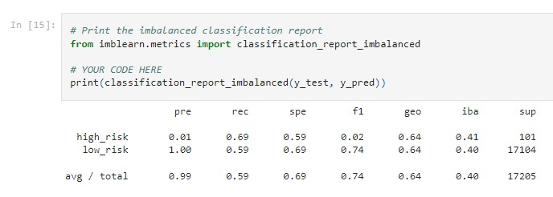
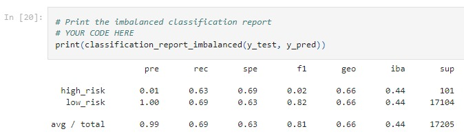
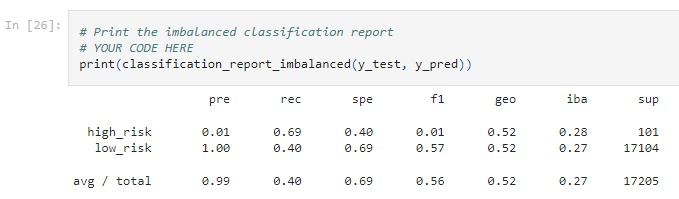
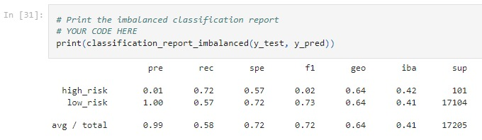
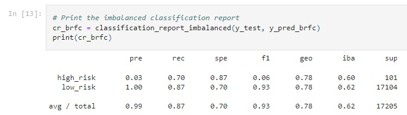
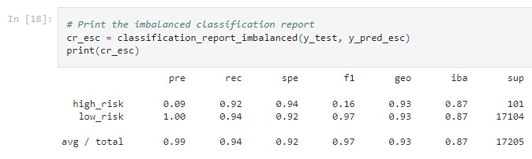

# Credit Risk Analysis Project.
## Project Description.
The project's sponsor commends the team for all your hard work so far; piece by piece, they have built up their data preparation skills, statistical reasoning, and machine learning. Now, it's time to apply machine learning to solve a real-world challenge: credit card risk.
Credit risk is an unbalanced classification problem, as good loans easily outnumber risky loans. Therefore, different techniques are needed to train and evaluate models with unbalanced classes. The stakeholders expect the project manager to use imbalanced-learn and scikit-learn libraries to build and evaluate models using resampling.

## Project Scope.
Using the credit card credit dataset from LendingClub, a peer-to-peer lending services company, the analysts will oversample the data using the RandomOverSampler and SMOTE algorithms and undersample the data using the ClusterCentroids algorithm. Then, a combinatorial approach of over- and undersampling will be conducted using the SMOTEENN algorithm. 
Furthermore, to predict credit risk, it's necessary to compare two new machine learning models that reduce bias, BalancedRandomForestClassifier and EasyEnsembleClassifier. Once done, it will be evaluated the performance of these models and make a written recommendation on whether they should be used to predict credit risk.

## Project Deliverables.
This new project consists of three technical analysis deliverables and a written report describing the outcomes. As documents, the project team will submit the following:
- Deliverable 1: Use Resampling Models to Predict Credit Risk
- Deliverable 2: Use the SMOTEENN Algorithm to Predict Credit Risk
- Deliverable 3: Use Ensemble Classifiers to Predict Credit Risk
- Deliverable 4: A Written Report on the Credit Risk Analysis (README.md)

## Results.
### Deliverable 1:
- Oversampling:
    - Balanced Accuracy: 64.08%. Reasonably not enough; it's not a substantial credit risk analysis rate.
    - Precision: Relatively high accuracy on the low-risk; however,  it can be considered dire when analyzing the high-risk. The false flagging calls for attention as low-risk as high-risk.
    - Recall: 69% of high risks were caught; on the other hand, 41% received false flagging.

- SMOTE:
    - Balanced Accuracy: 66.41% indicates poor performance and not an excellent rate for credit risk analysis.
    - Precision: Relatively high accuracy on the low-risk; however, it can be considered dire when analyzing the high-risk. The false flagging calls for attention as low-risk as high-risk.
    - Recall: 63% of high risks were caught; on the other hand, 44% received false flagging.

- Undersampling (ClusterCentroids):
    - Balanced Accuracy: 54.47%. Poor performance; it's not a substantial credit risk analysis rate.
    - Precision: Relatively high accuracy on the low-risk; however, it can be considered dire when analyzing the high-risk. The false flagging calls for attention as low-risk as high-risk.
    - Recall: Around 69% of high-risk caught correct, but low-risk got false positives equal to 60%.

### Deliverable 2:
- SMOTEENN:
    - Balanced Accuracy: 64.84%. indicates poor performance and not an excellent rate for credit risk analysis.
    - Precision: Relatively high accuracy on the low-risk; however, it can be considered dire when analyzing the high-risk. The false flagging calls for attention as low-risk as high-risk.
    - Recall: Around 72% of high-risk caught correct, but low-risk got false positives equal to 43%.

### Deliverable 3:
- Balanced Random Forest Classifier:
    - Balanced Accuracy: 78.85%. It indicates good performance, but here fits an observation; it may need improvements.
    - Precision: Considerable low-risk precision, but only about 3% on high-risk. Statistically, a distortion is noted, observing many false positives.
    - Recall: High-risk recall is the same as observed in the previous models, with around 70% positive flags. But, on the other side, Only 13% of false flagging for low credit risk individuals.

- EasyEnsembleClassifier (AdaBoost Model):
    - Balanced Accuracy: The best performance related to the accuracy in this model is around 93.16%.
    - Precision: Low-risk performs fine. The Dataframe is distorted because of 994 false positive outcomes of high-risk accounts.
    - Recall: Excellent when observing high-risk identification, around 92%. At the same time, Perfect for the low-risk title, where only 6% of accounts were falsely flagged as high-risk. 

## Summary.
In summary, reviewing all six models, the EasyEnsembleClassifer model generated impressive results. An accuracy rate of 93% and a 9% related to high-Risk candidates. Furthermore, the recall rate was also the highest at 94% compared to the other models. 
Besides that, the result for low-risk also performed pretty well, demonstrating a sensitivity rate of 92% and an F1 score of 97%. Therefore, the project team recommends this model as a clear choice when analyzing the algorithm's results, as it is highly fittable for this type of analysis.

